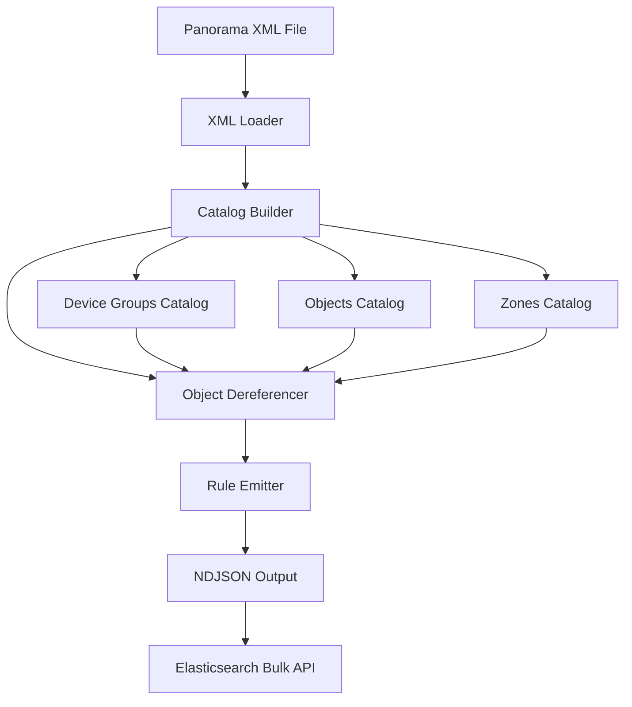

# Design Document

## Overview

The Panorama Rules Ingestion system is designed as a modular Laravel application that transforms Palo Alto Panorama XML configuration exports into searchable Elasticsearch documents. The system follows a pipeline architecture with distinct phases: XML loading, catalog building, object dereferencing, and document emission.

The design emphasizes data integrity, auditability, and performance while handling the complex hierarchical nature of Panorama configurations. Each security rule becomes a self-contained Elasticsearch document with both original references and fully expanded values.

## Architecture

### High-Level Flow



### Service Architecture

The system is organized into focused service classes following single responsibility principle:

1. **PanoramaXmlLoader**: Handles XML file loading with proper error handling and memory management
2. **CatalogBuilder**: Constructs lookup catalogs for device groups, objects, and zones
3. **Dereferencer**: Resolves object references and expands groups with cycle detection
4. **RuleEmitter**: Walks rule structures and emits NDJSON documents
5. **ImportPanorama Command**: Orchestrates the entire process as an Artisan command

### Data Flow

1. **Input Phase**: XML file is loaded and parsed into SimpleXMLElement structure
2. **Catalog Phase**: Device group hierarchy and object catalogs are built for fast lookups
3. **Processing Phase**: Security rules are processed, references resolved, and groups expanded
4. **Output Phase**: Structured documents are emitted as NDJSON for Elasticsearch bulk loading

## Components and Interfaces

### PanoramaXmlLoader

**Purpose**: Safely load and parse large Panorama XML files

**Interface**:
```php
class PanoramaXmlLoader
{
    public function load(string $path): \SimpleXMLElement
}
```

**Key Features**:
- Uses libxml error handling for detailed parsing feedback
- Configures LIBXML_COMPACT and LIBXML_PARSEHUGE for large files
- Throws descriptive exceptions on parsing failures

### CatalogBuilder

**Purpose**: Build comprehensive lookup catalogs from XML configuration

**Interface**:
```php
class CatalogBuilder
{
    public function build(\SimpleXMLElement $root): array
    
    private function buildDeviceGroups(\SimpleXMLElement $cfg): array
    private function buildObjects(\SimpleXMLElement $cfg, array $dgs): array
    private function buildZones(\SimpleXMLElement $cfg, array $dgs): array
}
```

**Catalog Structure**:
- **deviceGroups**: Hierarchical tree with parent-child relationships and computed paths
- **objects**: Nested arrays by scope (Shared, device groups) and type (address, service, application)
- **zones**: Zone availability by device group (simplified global union in v1)

**Object Types Supported**:
- Addresses: IP, CIDR, range, FQDN
- Address Groups: Static (member lists) and Dynamic (filter expressions)
- Services: TCP/UDP with port specifications
- Service Groups: Member lists
- Applications: Individual applications
- Application Groups: Member lists

### Dereferencer

**Purpose**: Resolve object references following inheritance hierarchy and expand groups

**Interface**:
```php
class Dereferencer
{
    public function __construct(public array $catalog)
    
    public function expandAddresses(string $dgName, array $names): array
    public function expandServices(string $dgName, array $names): array
    public function expandApplications(string $dgName, array $names): array
    public function zonesFor(string $dgName, array $zoneNames): array
}
```

**Resolution Logic**:
- Follows device group inheritance path: current DG → ancestors → Shared
- Handles static group expansion with cycle detection
- Marks dynamic address groups as unresolved (DAG:name format)
- Preserves unknown references with UNKNOWN: prefix for audit trails

### RuleEmitter

**Purpose**: Process security rules and emit structured Elasticsearch documents

**Interface**:
```php
class RuleEmitter
{
    public function __construct(
        private string $tenant,
        private string $snapshotDate,
        private Dereferencer $deref
    )
    
    public function emitSecurityRulesAsNdjson(\SimpleXMLElement $root, $stream): int
}
```

**Document Generation**:
- Processes pre-rules, local rules, and post-rules separately
- Generates unique rule UIDs: `{deviceGroup}:{rulebase}:{position}:{ruleName}`
- Maintains rule position within each rulebase
- Handles rule targets (included/excluded devices)

### ImportPanorama Command

**Purpose**: Orchestrate the ingestion process as a Laravel Artisan command

**Interface**:
```php
class ImportPanorama extends Command
{
    protected $signature = 'panorama:import 
        {--file= : Path to Panorama XML export} 
        {--tenant= : Logical tenant name}
        {--date= : Snapshot date YYYY-MM-DD} 
        {--out= : NDJSON output path}';
}
```

**Command Features**:
- Configurable input/output paths with sensible defaults
- Progress reporting and completion statistics
- Proper error handling and exit codes
- Integration with Laravel's storage system

## Data Models

### Elasticsearch Document Structure

Each security rule produces one document with this structure:

```json
{
  "panorama_tenant": "string",
  "snapshot_date": "date",
  "device_group": "keyword",
  "device_group_path": ["keyword"],
  "rulebase": "keyword",
  "rule_name": "keyword", 
  "rule_uid": "keyword",
  "position": "integer",
  "action": "keyword",
  "disabled": "boolean",
  "targets": {
    "include": ["keyword"],
    "exclude": ["keyword"]
  },
  "orig": {
    "from_zones": ["keyword"],
    "to_zones": ["keyword"],
    "sources": ["keyword"],
    "destinations": ["keyword"],
    "applications": ["keyword"],
    "services": ["keyword"],
    "users": ["keyword"],
    "tags": ["keyword"],
    "profiles": {
      "group": "keyword",
      "names": ["keyword"]
    },
    "comments": "text"
  },
  "expanded": {
    "from_zones": ["keyword"],
    "to_zones": ["keyword"],
    "src_addresses": ["keyword"],
    "dst_addresses": ["keyword"],
    "applications": ["keyword"],
    "services": ["keyword"],
    "ports": ["keyword"],
    "users": ["keyword"],
    "tags": ["keyword"]
  },
  "meta": {
    "has_dynamic_groups": "boolean",
    "dynamic_groups_unresolved": ["keyword"],
    "unresolved_notes": "text"
  }
}
```

### Internal Catalog Models

**Device Group Structure**:
```php
[
  'name' => 'string',
  'parent' => 'string|null',
  'children' => ['string'],
  'path' => ['string']  // computed inheritance path
]
```

**Object Structures**:
```php
// Address
['kind' => 'ip|cidr|range|fqdn', 'value' => 'string']

// Address Group
['kind' => 'static|dynamic', 'members' => ['string'], 'match' => 'string|null']

// Service  
['proto' => 'tcp|udp|ip|other', 'ports' => ['string']]

// Service/Application Group
['members' => ['string']]
```

## Error Handling

### XML Parsing Errors
- Use libxml_get_errors() for detailed error reporting
- Provide file location and specific parsing issues
- Fail fast with descriptive error messages

### Object Resolution Errors
- Mark unresolved references with UNKNOWN: prefix
- Continue processing to maximize data extraction
- Log warnings for audit and troubleshooting

### Memory Management
- Use streaming for NDJSON output to handle large rule sets
- Configure XML parser for large document handling
- Process rules incrementally rather than loading all into memory

### Cycle Detection
- Track visited objects during group expansion
- Break cycles gracefully and log warnings
- Prevent infinite loops in malformed configurations

## Testing Strategy

### Unit Tests

**PanoramaXmlLoader Tests**:
- Valid XML parsing
- Malformed XML error handling
- Large file handling
- Memory usage validation

**CatalogBuilder Tests**:
- Device group hierarchy construction
- Object catalog building across scopes
- Inheritance path computation
- Edge cases (missing parents, circular references)

**Dereferencer Tests**:
- Object resolution following inheritance
- Static group expansion
- Dynamic group marking
- Cycle detection and prevention
- Unknown reference handling

**RuleEmitter Tests**:
- Document structure validation
- Rule UID generation
- Position tracking
- Target processing
- NDJSON format compliance

### Integration Tests

**End-to-End Processing**:
- Complete XML file processing
- Output validation against expected documents
- Performance testing with large configurations
- Memory usage monitoring

**Command Interface Tests**:
- Parameter validation
- Error handling and exit codes
- Progress reporting
- File I/O operations

### Test Data Strategy

**Sample XML Files**:
- Minimal valid configuration
- Complex hierarchy with multiple device groups
- Various object types and group structures
- Edge cases (empty sections, malformed elements)
- Large-scale configuration for performance testing

**Expected Outputs**:
- Reference NDJSON documents for validation
- Elasticsearch mapping compatibility
- Document uniqueness verification

### Performance Testing

**Benchmarks**:
- Processing time vs. configuration size
- Memory usage patterns
- NDJSON generation speed
- Elasticsearch bulk loading performance

**Scalability Tests**:
- Large device group hierarchies
- High rule counts per device group
- Complex object inheritance chains
- Memory usage under load

## Security Considerations

### Input Validation
- XML file size limits to prevent DoS
- Path traversal protection for file inputs
- Sanitization of output file paths

### Data Handling
- No sensitive data logging in error messages
- Secure temporary file handling
- Proper cleanup of processing artifacts

### Access Control
- Command execution requires appropriate Laravel permissions
- File system access limited to designated directories
- Elasticsearch credentials managed through Laravel configuration